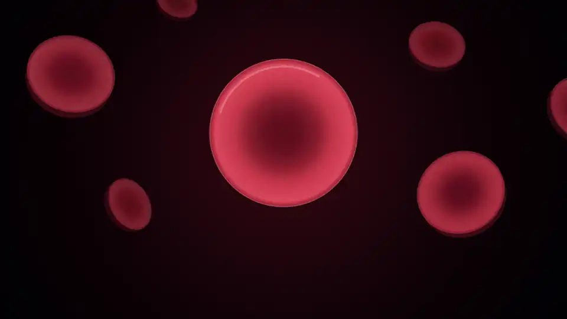

# Vibe 知识大赏 · 视频生成 Skill

> 你一定在抖音刷到过「Vibe 知识大赏」「光影字幕科普」这类视频：
> 2–5 分钟、16:9、没人声、底部一行字幕、画面在正中把那句话"演出来"。
> 看完收获满满。
>
> **这个仓库就是那个 skill**：把选题丢进去，自动出文案、分镜、动效、字幕、声音，
> 渲出成片 .mp4 可直接发抖音 / 视频号 / B 站。

---

## 🎬 三步成片

```bash
# 0. 装好（一次性，约 5 分钟）
pip install -r requirements.txt
python -m playwright install
python engine/get_fonts.py

# 1. 在 Agent 里对它说一句话
#    "用这个 skill 给我做一条 vibe 知识大赏的视频，主题是「为什么时间越长大过得越快」"

# 2. Agent 帮你自动出：选题 → 文案 → 分镜 → 画面代码 → 渲染 → 配声

# 3. 等几分钟后，projects/<工程名>/renders/final.mp4 就是成片
```

**不需要会写代码。** 你只要选题目；Agent 帮你写文案、排分镜、画画面、渲视频、混声音。
你看完不满意就让它改。

---

## 🆕 最新：一条 101 秒的完整成片

[`examples/learn_addiction/`](examples/learn_addiction/) 是一条**从头到尾做完**的片子工程（101 秒，C 夜曲），
主题是《如何像刷短视频一样对学习上瘾》。它比 `fold_C` / `pigeon_B` 那两个 33 秒开头复杂一整个量级，
代表了这套 skill 目前能摸到的质量上限，里面有这些可以直接学的做法：

| 做法 | 在哪 |
|---|---|
| 手机屏里滚动的信息流（`fr.g({ clip })` 裁切滚动） | `film.js` 开场钩子 |
| 斯金纳箱 + 累积记录曲线（把"历史"采样成数组再按 t 取） | 第一章 机器 |
| 多巴胺放电峰（高斯峰 + 峰位从"奖励"移到"信号"） | 第二章 信号 |
| 盲盒翻面（`fr.g({ s: [sx, 1] })` 非等比缩放） | 第四章 四招 |
| 断供后的消耗带 + 电量条 | 第五章 断供 |
| 末句回场：开场那只手机又回来了，这次里面装的是学习 | 答 |

另有 [`examples/helpless/`](examples/helpless/)——《习得性无助》，B 寓言，100 秒完整成片：色块拼的狗当主角，
「放弃指数」仪表当贯穿全片的尺子，三根归因滑块、三张"怎么解开"的卡片、末尾把那道矮栏原样请回来。

以及最新的 [`examples/entropy/`](examples/entropy/)——《熵增》，B 寓言，100 秒完整成片（复刻抖音同主题爆款）：
12 件东西按 t 逐个歪、滑、倒；13 张牌洗牌；麦克斯韦妖与兰道尔原理；左上的「熵值」仪表**结尾停在 60 不回到 0**，
尺子的收法本身就把结论说了。

以及最新的 [`examples/bystander/`](examples/bystander/)——《旁观者效应》，B 寓言，100 秒完整成片。
**先信后破**的结构：先讲 1964 年"38 位目击者无人报警"的传说，再拿 2007 年的案卷把它推翻，
接 1968 年的两个真实验，最后用 2020 年 219 段真实监控的 **90.9% 有人出手**收尾。
尺子是「现场人数」仪表，副标题实时显示"我的责任 1/N"——**人数不减到 0，指针却从 12 落回 1**。
B 外观最新的质量上限看这条。

**做长片的硬经验**（子段必须用 `fade()` 不能用 `ss()`、事件数组、贯穿全片的"尺子"、转场 `K.dips`、渲染顺序、环境坑）
单独写在 [`references/craft.md`](references/craft.md) 里，开工前先过一遍。

---

## 👀 看看做出来什么样

| 外观 | 适合讲什么 | 样片 |
|---|---|---|
| **C 夜曲**（黑底金/白/青，星光辉光） | 抽象概念、看不见的机制、需要拆成几个当场可演的小实验 |  |
| **B 寓言**（有角色、有场景、有仪表） | 心理、行为机制，从动物/生活场景讲到"你该怎么办" |  |

| 同主题不同版本对照 | 配图 vs 讲解 |
|---|---|
| 同样是"蛋白质折叠"——左：装饰动画 / 右：镜头钻进红细胞、看见那串珠子 | [examples/fold_old_vs_new.jpg](examples/fold_old_vs_new.jpg) |

更多静帧和复刻参考：[examples/](examples/)

---

## 🤔 这是怎么做到的

**一句话原理**：用 Canvas + JavaScript 把每一帧"画"出来，浏览器一帧一帧截图，ffmpeg 压成视频，再混上声音。

**这套 skill 包含**：
- 引擎：`engine/vk.js` `vk-kit.js` 暴露 50+ 画图 API（字、圆、线、路径、辉光、光点、星点、彗尾、渐变…）
- 渲染器：`engine/render.py` 驱动 Chrome 一帧一帧截图，自动分片并行
- 音频合成：`engine/audio.py` 把"按键音 / 钟声 / 鼓 / 闪烁"等 11 种声音事件合成音轨
- 字体：8 套 SIL OFL 开源中英文字体（Noto Serif SC、Lora、Cormorant Garamond…）
- 6 套画法 + 4 条参考片拆解 + 反向提示词：见 `references/`

---

## 📚 给小白的完整教程

### 方式 A：让 Agent 帮你做（推荐，零代码）

1. **把仓库克隆或下载到本地**：
   ```bash
   git clone https://github.com/zhaosenlin12-creator/vibe-know--skill.git
   ```
   放到本地任意目录，文件夹名保持 `vibe-know--skill` 不动。

2. **（可选）把目录放到 Agent 的 skill 目录**：
   - Claude Code / Codex / WorkBuddy 的 skill 目录通常是 `~/.claude/skills/` 或 `~/.codex/skills/`
   - 把 `vibe-know--skill` 软链或复制进去，名字就是 `vibe-know--skill`
   - **不放也行**——你直接在 Agent 里"读这个目录的 SKILL.md"也能用

3. **装好本机依赖**（一次性，约 5 分钟）：
   ```bash
   pip install -r requirements.txt
   python -m playwright install        # 装一个 Chromium 给 playwright 控制
   python engine/get_fonts.py          # 下 8 套开源字体（仓库里没有，避免版权问题）
   ```
   还要本机装了 **Google Chrome** 和 **ffmpeg**。检查：
   ```bash
   google-chrome --version     # 或 chrome --version
   ffmpeg -version
   ```
   没装去官网下：Chrome <https://www.google.com/chrome/>，ffmpeg <https://ffmpeg.org/download.html>

4. **在 Agent 里对模型说**（用中文或英文都行）：
   > 用 vibe-knowledge-film 这个 skill 给我做一条 vibe 知识大赏视频。
   > 主题是「为什么时间越长大过得越快」。
   > 长度 90 秒。
   > 外观选 C 夜曲。
   > 文案先给我看，分镜表给我看，我确认后再渲。

5. **Agent 的工作流**（自动，你审就好）：
   - 立题 + 查事实 + 列事实表
   - 选外观 + 排分镜表（22 句左右）
   - 写 `film.js`（画每一镜）
   - 拼图自查（--sheet 16）
   - 渲染全片（--jobs 4）
   - 合成音效（--events + audio.py）
   - 给你 `projects/.../renders/final.mp4`

6. **看完想改**？直接告诉 Agent：
   - "14 秒那块太挤了，把数字改小"
   - "钩子那 1 秒字看不见，亮一点"
   - "整片太短，扩到 2 分钟"
   - "换主题"（传新题目就行）

### 方式 B：自己写代码做（给开发者 / 进阶用户）

```bash
# 1. 拷一份参考片
cp -r examples/fold_C my_film

# 2. 看分镜表和代码
cat my_film/storyboard.md
cat my_film/film.js

# 3. 改文案 / 改画面代码
$EDITOR my_film/film.js

# 4. 实时预览
python engine/render.py my_film --serve
# 浏览器打开 http://localhost:8000 ，拖时间条看任意一帧

# 5. 拼图自查
python engine/render.py my_film --sheet 16

# 6. 全片渲染
python engine/render.py my_film --jobs 4

# 7. 加音效
python engine/render.py my_film --events
python engine/audio.py my_film

# 8. 加自己的 BGM
python engine/audio.py my_film --bgm 我的歌.mp3 -8

# 9. 看成片
open my_film/renders/final.mp4
```

**代码怎么写**？先把 `references/visualization.md` 读完——这是核心：四张表教你怎么把"一个概念"变成"屏上一个观众认得的东西"。然后看 `references/engine.md` 学 API。
要做 90 秒以上的长片，**再读一遍 `references/craft.md`**——时间轴表、贯穿全片的"尺子"、子段必须用 `fade()`、事件数组、`K.dips` 转场、渲染顺序，全在里面；有一条没守住就会返工。

---

## 📁 文件结构

```
vibe-know--skill/
├── SKILL.md               ← 完整流程（给 Agent 看的"操作手册"）
├── README.md              ← 你正在读这个
├── LICENSE                ← MIT 许可
├── requirements.txt       ← Python 依赖
├── engine/                ← 引擎（你不用动）
│   ├── vk.js              ← 画图 API：rect/circle/line/path/glow/spark/comet/text/chars/poly/...
│   ├── vk-kit.js          ← 常用组合：片名卡、章节标、仪表、震铃、滚屏…
│   ├── render.py          ← Playwright 逐帧截图 + ffmpeg 拼视频
│   ├── audio.py           ← 11 种事件音合成
│   ├── get_fonts.py       ← 下载 8 套开源字体
│   └── fonts/             ← 字体目录（运行 get_fonts.py 后才有）
├── scripts/
│   └── new_film.py        ← 一键建工程
├── references/            ← 8 份参考文档
│   ├── visualization.md   ← 必读：4 条参考片拆解 + 6 种画法 + 找形象
│   ├── engine.md          ← 引擎 API 速查
│   ├── craft.md           ← 做长片（90–150 秒）的硬经验与避坑
│   ├── script.md          ← 文案的量、骨架、句式
│   ├── worlds.md          ← 两套外观的规格
│   ├── analysis.md        ← 参考片结构分析
│   ├── prompts.md         ← 反向提示词（含完整 brief 模板）
│   └── visual-grammar.md  ← 版式 / 颜色 / 动效 / 转场
└── examples/              ← 8 个工程 / 拆解对照
    ├── learn_addiction/   ← 101 秒完整成片《学习上瘾》（夜曲）
    ├── bystander/         ← 🆕 100 秒完整成片《旁观者效应》（寓言，当前质量上限）
    ├── entropy/           ← 100 秒完整成片《熵增》（寓言）
    ├── helpless/          ← 100 秒完整成片《习得性无助》（寓言）
    ├── fold_C/            ← 《折叠》夜曲版开头
    ├── pigeon_B/          ← 《鸽子的迷信》寓言版开头
    ├── info_C/, stim_B/   ← 两条参考片的复刻（学习用）
    ├── kit_gallery/       ← 引擎能力图鉴
    └── *.webp, *.jpg      ← 预览
```

---

## 🎯 适合做什么样的内容

| ✅ 适合 | ❌ 不适合 |
|---|---|
| 心理学 / 行为学机制（达克效应、习得性无助、心流…） | 有人声口播的讲解片（请用别的工具） |
| 看不见的物理 / 神经科学原理（多巴胺、心跳、记忆…） | 实时新闻、热点评论 |
| 一个数学 / 哲学概念在生活里的体现（时间、概率、信息…） | 需要演真实人物场景的故事片 |
| 复刻抖音热门知识视频 | 商业广告 / 品牌片 |

**最佳长度**：2–3 分钟（90–180 秒）。30 秒太短讲不透；5 分钟太长完播率掉。

---

## ❓ 常见问题

**Q：需要显卡吗？**
A：不需要。这套用 CPU + Chrome 软渲，一张 RTX 3060 不带没区别。

**Q：渲 90 秒要多久？**
A：约 3–5 分钟（Chrome 单进程）。4 路并行 (`--jobs 4`) 再快一点。

**Q：没装 Chrome / ffmpeg 会怎样？**
A：报错提示。装好后重跑就行。

**Q：可以商用吗？**
A：引擎、脚本、文档是 MIT，你想怎么用怎么用。
⚠️ **但 examples/ 里有两段 (`stim_B` `info_C`) 是从别人的原片"复刻"来的学习对照**——只用于学习研究，不要发布成自己的作品。

**Q：能做竖屏 9:16 吗？**
A：当前版本只做 16:9 横屏（适配抖音横屏 / 视频号 / B 站）。
竖屏是另一个项目。

**Q：内容准确吗？**
A：每个数字、每个年份都要求带出处。Agent 渲之前会让你看事实表。
拿不准的会标"示意"。

**Q：能加自己的 BGM 吗？**
A：能。
```bash
python engine/audio.py <工程> --bgm 你的歌.mp3 -8
```
`-8` 是 BGM 音量（dB），调到合适的就成。

**Q：和 Sora / Runway 比起来呢？**
A：完全不同赛道。AI 视频生成模型是"让模型拍一段"，这个是"用代码精确画一段"——
每个数字、每个年份、每个画面元素你都控制得了，所以**做知识片而不是炫技片**。
当然生成模型做不出的"在屏上把公式算出来""精确对照""同一概念用四种画面比喻"，这个都行。

---

## 🙏 致谢

- 原 skill 作者：[Dave-cc](https://github.com/Dave-cc)（vibe-knowledge-film）
- 字体：SIL OFL（Noto Sans/Serif SC, Lora, Cormorant Garamond, JetBrains Mono, Courier Prime）
- 出处资料：Schultz, Dayan & Montague 1997；Ferster & Skinner 1957；Amabile & Kramer 2011；Zeigarnik 1927；Fogg 2019；Opie 1953；O'Keefe & Burgess 1996；Block & Zakay 1997；等等。

---

## 📜 许可

引擎、脚本、文档：**MIT**，见 [LICENSE](LICENSE)。

`examples/stim_B/` `examples/info_C/`：来自他人的成片，**版权属于原作者**，仅作学习对照，**请勿发布**。
